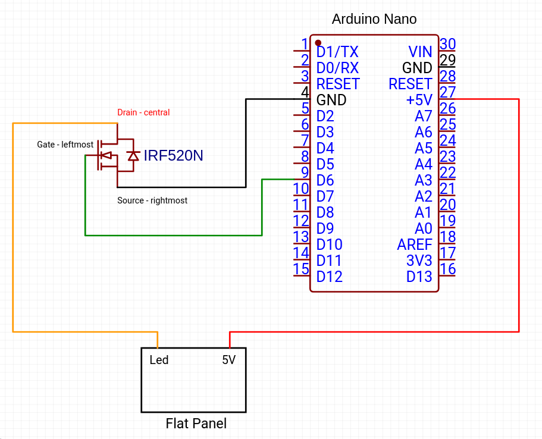

# DIY Flat Panel

A DIY PC-controlled flat panel for astrophotography calibration frames, using the [Alnitak](http://www.optecinc.com/astronomy/catalog/alnitak/flip-flat.htm) (Flip-Flat/Flat-Man) serial protocol. Compatible with NINA, SGP, and other capture software that supports Alnitak devices.

## How It Works

An Arduino Nano drives an A4 LED light pad via PWM through an IRF520N MOSFET, allowing software to control brightness (0-255) over a serial connection at 9600 baud.

## Hardware

### Components
- Arduino Nano
- IRF520N N-channel MOSFET
- A4 LED light pad (see [tested panels](#tested-flat-panels) below)

### Circuit

- **D6** (PWM) connects to the MOSFET gate to control LED brightness
- The MOSFET switches the flat panel's LED line, with the panel powered from its own 5V supply
- The Arduino is powered via USB

### 3D Printed Parts

The `src/openscad/` directory contains two printable parts:

- **flatpanel.scad** - Panel cover with a center hole for the telescope (95mm diameter) and mounting feet. Sized for an A4 light pad (340x240mm usable area).
- **arducover.scad** - Enclosure for the Arduino Nano with an integrated USB cable clip.

Open in [OpenSCAD](https://openscad.org/) to preview, then export to STL for printing.

## Firmware

The Arduino firmware (`src/arduino/flatpanel.ino`) implements the Alnitak command protocol. Open in Arduino IDE and upload — no external libraries required.

## Tested Flat Panels

Uniformity tested using [John Upton's method](docs/test_flat_panel.md).

| Panel | Purchased | Status | Uniformity |
|-------|-----------|--------|------------|
| [NXDRS A4](https://www.amazon.it/gp/product/B07GPRGKPY) | Sep 2020 | Died Nov 2023 | 1.6% |
| [Omasi A4](https://www.amazon.it/gp/product/B089LPMDDS) | Nov 2023 | Active | 0.59% |

## Changelog

- **1.0** - Initial revision
- **1.1** - Panel height increased by 1mm (2mm to 3mm); arducover made smaller
- **1.2** - Added bigger feet and middle feet on the long sides

## Credits

- https://www.blackwaterskies.co.uk/2020/03/cheap-diy-remote-controlled-flat-panel/
- https://github.com/red-man/Alnitak-Lightbox-Clone/
- https://gist.github.com/ednisley/52b8a6303fa130fe38858488b978874b
